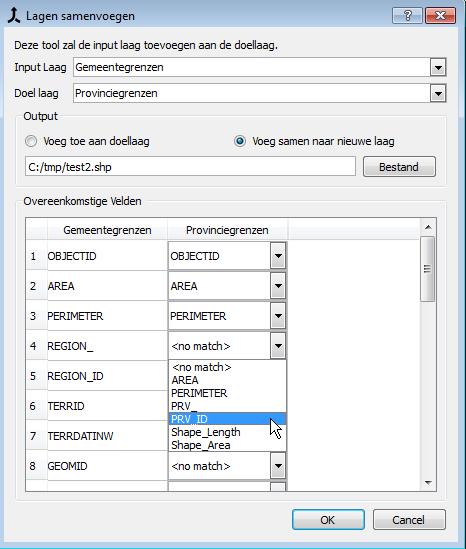

Merge Layers with different attributes 
====

This tool allows you to append one layer to another when the attributes don't match.

Voeg lagen samen wanneer de attributen verschillen
====

Met deze tool kan je 2 lagen samenvoegen wanneer de namen van oovereenkomstige attributen verschillen.

