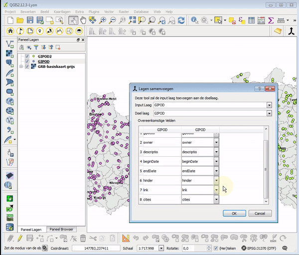

Merge Layers with different attributes 
====

This tool allows you to append one layer to another when the attributes don't match.

- The input layer is added to the data in the target layer, if *"Add to target layer"* is checked.
- A new layer will be created if *"Merge into new layer"* is checked.
- You must enter the corresponding fields between the input layer and the target layer in the table below.
- If you click OK he layers will be merged. 

Voeg lagen samen wanneer de attributen verschillen
====

Met deze tool kan je 2 lagen samenvoegen wanneer de namen van overeenkomstige attributen verschillen.

- De input laag wordt toegevoegd aan de data in de doel laag, als *"Voeg toe aan doellaag"* aanvinkt is.
- Er wordt een nieuwe laag aangemaakt indien *"Voeg samen naar nieuwe laag"* aangevinkt is.
- Je moet de overeenkomstige velden tussen de inputlaag en de doellaag ingeven in de onderstaande tabel. 
- Als je op OK klikt wordt bwerking uitgevoerd. 

